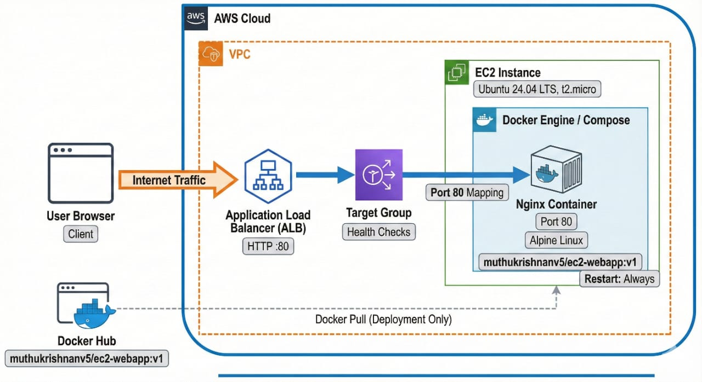
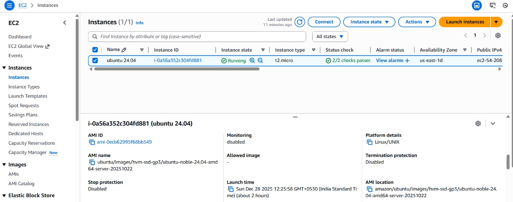
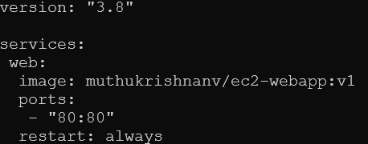
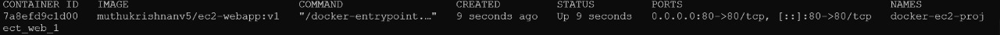
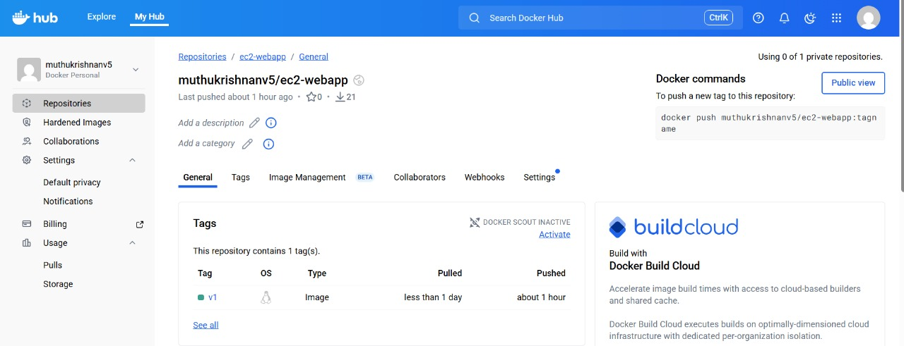
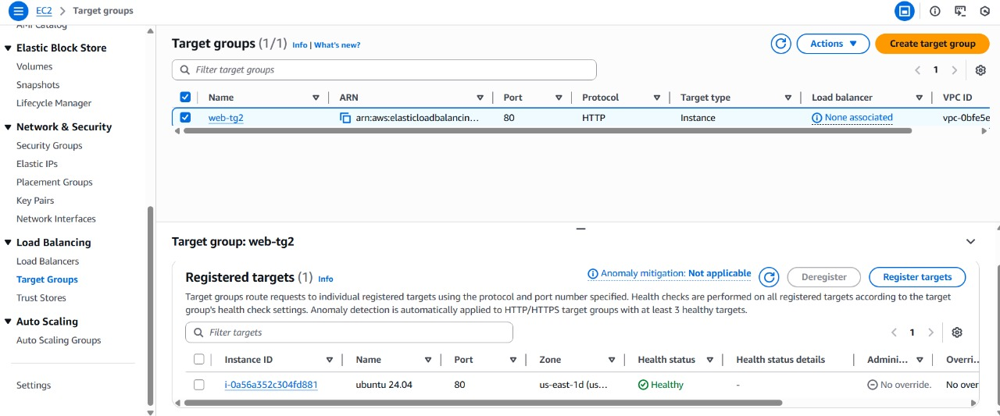
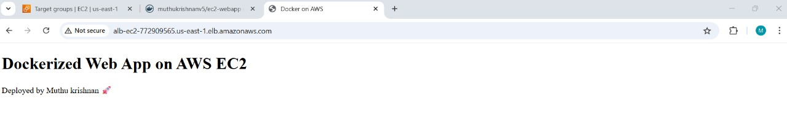

# 🚀 Dockerized Web Application on AWS EC2 using Docker Compose & ALB

## 📌 Project Overview
This project demonstrates a real-world Docker deployment on AWS EC2.  
The application is containerized using Docker, managed with Docker Compose, and exposed via an Application Load Balancer (ALB).

All screenshots below are linked proofs of each step, from architecture design to final live website.

---

## 🧱 Architecture Diagram

**Click to view full image:**  



---

## ⚙️ Technologies Used
- AWS EC2 (Ubuntu 24.04 LTS)
- Docker
- Docker Compose
- Docker Hub
- Nginx (Alpine)
- Application Load Balancer (ALB)
- HTML

---

## 📁 Project Structure

```
.
├── Dockerfile
├── docker-compose.yml
├── index.html
├── README.md
├── architecture/
│   └── architecture-diagram.png
└── Screenshots/
    ├── 01-ec2-running.png
    ├── 02-docker-compose-file.png
    ├── 03-docker-ps.png
    ├── 04-dockerhub-repo.png
    ├── 05-target-group-healthy.png
    └── 06-website-via-alb.png
```

---

## 📸 Proof of Work (Step-by-Step Screenshots)

### 1️⃣ EC2 Instance Running



---

### 2️⃣ Docker Compose Configuration



---

### 3️⃣ Docker Container Running (`docker ps`)



---

### 4️⃣ Docker Hub Repository



---

### 5️⃣ Target Group Health Check (ALB)



---

### 6️⃣ Website Accessed via ALB DNS (Final Proof)



---

## 🐳 Docker Configuration

### Dockerfile
```dockerfile
FROM nginx:alpine
COPY index.html /usr/share/nginx/html/index.html
```

### docker-compose.yml
```yaml
version: "3.8"

services:
  web:
    image: muthukrishnanv5/ec2-webapp:v1
    ports:
      - "80:80"
    restart: always
```

---

## 🎯 Interview One-Liner

> Deployed a Dockerized web application on Ubuntu 24.04 EC2 using Docker Compose, pushed the image to Docker Hub, and exposed it through an Application Load Balancer with healthy target checks.

---

## 👤 Author
**Muthu Krishnan**  
Cloud & DevOps Enthusiast  
AWS • Docker • Linux
